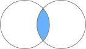

# データの結合方法(横)

SQLの結合の種類や概念は、他の言語で結合をする際もパラメータのベースになっていることがほとんどで、種類や違いを覚えておくと役に立ちます。

結合におけるSASとSQLの主な違いとしては結合の際にはソートが不要なことがあげられ、好んで使われることもよくあります。ほかに特徴的な違いとしては、同名の列はデータステップでは区別されずに上書きされていきますが、SQLでは区別して扱われます。

3つ以上のテーブルの結合は可読性も低くなりやすく、条件も複雑な場合はSASや他言語のライブラリからのほうが扱いやすいかもしれません。

## テーブルの関係

テーブルを結合する前にはテーブル間の関係を把握しておく必要があります。複雑なテーブルの関係はER(Entity Relationship)図という図で表現されることもあります。

テーブル間の関係性は大きく以下の3つがあります。

- `1対1`  ID - メールアドレスなど  

テーブル1  ユーザー情報
| ID | ユーザー名 |
| --- | --- |
| 001 | AA AA |
| 002 | BB BB |

テーブル2  登録情報
| ID | メールアドレス |
| --- | --- |
| 001 | AA@mail.com |
| 002 | BB@mail.com |

- `1対多`  性別コード - 各ユーザーの性別  

テーブル1 性別コード
| 性別コード | 性別 |
| --- | --- |
| 01 | 男 |
| 02 | 女 |
| 99 | 不明 |

テーブル2 ユーザー情報
| ID | 性別コード |
| --- | --- |
| 001 | 02 |
| 002 | 01 |
| 003 | 01 |
| 004 | 02 |
- `多対多`

多対多の関係の場合、基本的には結合することはできません。キーの追加が必要か、中間テーブルを利用します。例えば前のユーザー情報のテーブルと、兼部の場合もある部署テーブルは関係としては多対多ですが、この場合は間に中間テーブルを挟んでデータを格納・処理する必要があります。

テーブル1  
| 部署コード | 部署 |
| --- | --- |
| 01 | A部 |
| 02 | B部 |
| 03 | C部 |

テーブル2 ユーザー情報  
省略

テーブル3 中間テーブル
| ID | 部署コード |
| --- | --- |
| 001 | 01 |
| 001 | 02 |
| 002 | 01 |
| 003 | 02 |
| 004 | 03 |

ER図上では記法によりさらに「0以上」「1以上」や「0または1」という情報を付与する場合もあります。

## 結合の基本

テーブルを結合する際は上記の関係に加えて、特にテーブルの関係に「0」(マッチしないこと)を含む場合には特に適切な結合の種類を選択が必要です。結合やその後の処理ががうまく実行できない場合に、結合の種類を変えれば実行できるようになることもありますが、キーの使い方や仕様に問題があるということもあります。テーブルの関係にあった結合を使用することが重要で、そのためにはまずテーブル間の関係をよく確認しておいてください。  
結合の説明はよくベン図を使って表現され、重なっている部分は共通のキーを持つレコード、重なっていない部分は共通のキーを持たないレコードで、色がついている部分が出力の対象になるレコードを表します。  
一般的にJOIN句とON句でキーを指定して結合します。以降では例としてsashelp.classに以下のテーブルを結合します。

| sex | code |
| --- | --- |
| M | 01 |
| F | 02 |
| UNKNOWN | 99 |

列名を指定する場合に列名が2つのテーブルで同じだと、どちらのテーブルの列か区別することができません。その場合`テーブル名.列名`として記載しますが、テーブルにAS句(省略可)で別名を指定しておくことが一般的です。

### INNER JOIN(内部結合)
  
INNER JOINは、両方のテーブルにマッチするレコードのみを結果として返します。INNERは省略できますが、記載しておくことをおすすめします。

```sql
SELECT a.*, b.code 
FROM sashelp.class AS a
INNER JOIN work.code b
/* JOIN work.code(where=(code="01")) b */
ON a.sex = b.sex
;
```

proc sqlで上の例でコメントアウトされているwork.codeのレコードを限定した条件で実行した場合、性別がMのレコードのみが出力され、性別がFのレコードは出力に含まれなくなります。

### LEFT JOIN・RIGHT JOIN(左結合・右結合)
 
LEFT JOINは、左テーブル(先に記載)のすべてのレコードと、右テーブル(後に記載)のマッチするレコードを結果として返します。マッチしない場合、右テーブルの値はNULLになります。LEFT OUTER JOINのように記載されることもありますが省略される方が一般的です。LEFT JOINとRIGHT JOINはテーブルの順番を変えれば動作は同じで、一般的にはLEFT JOINを使います。

```sql
SELECT a.*, b.code 
FROM sashelp.class AS a
LEFT JOIN work.code b
ON a.sex = b.sex
;
```

上の例ではsashelp.classに含まれない性別がUNKNOWNのレコードは出力には含まれません。

### FULL JOIN(完全外部結合)
 
FULL  JOINは、左テーブル(先に記載)のすべてのレコードと、右テーブル(後に記載)のすべてのレコードを結果として返します。マッチしない場合の値はNULLになります。FULL OUTER JOINのように記載されることもありますが省略される方が一般的です。

```sql
SELECT a.name, coalescec(a.sex, b.sex) AS sex, b.code 
FROM sashelp.class AS a
FULL JOIN work.code b
ON a.sex = b.sex
;
```

上の例ではsashelp.classに含まれない性別がUNKNOWNのレコードも出力に含まれるようになります。キーが同じ名前の場合には、coalesce・coalescec関数を使うとどちらかにしか含まれない値を1つの列にまとめることができます。

## 応用的な結合

### CROSS JOIN(クロス結合, デカルト積)

CROSS JOINは、左テーブルの各レコードに対して、右テーブルのすべてのレコードを組み合わせる結合です。結果は、左テーブルのレコード数と右テーブルのレコード数の積になります。CROSS JOIN句とカンマで複数のテーブルを指定する方法があります。

```sql
SELECT a.name, b.name AS name2 
FROM sashelp.class a
CROSS JOIN sashelp.class b
;
SELECT a.name, b.name AS name2 
FROM sashelp.class a, sashelp.class b
;
```

### RANGE JOIN(範囲結合)

結合条件として=だけでなく下限や上限を指定して結合することも可能です。ただし基本は1対1や1対多などの関係であり、多対多が発生する条件となっていると、想定と異なる結果になることもあるので注意してください。

SASでは複数の比較演算子をまとめて使用できますが、一般には1つだけで2つの場合はand や orを使う必要があります。

| 体重コード | lower | upper |
| --- | --- | --- |
| 01 | 0 | 100 |
| 02 | 100 | 999 |

```sql
SELECT a.name, b.name AS name2 
FROM sashelp.class a
LEFT JOIN work.code b
ON b.lower < a.weight and a.weight <= b.upper
/* ON b.lower < a.weight <= b.upper */
;
```

### キー指定の省略

以下の句ではキーの指定や指定の一部を省略することができます。ただし製品により使えることと使えないことがあったり、利用できる場合でも可読性が下がる場合もあるので、利用する際にはコーディングルールなどをよく確認しておくことをおすすめします。

ON句では2つの列が別々に扱われますが、以下では1つにまとめて扱われるため、列の型・長さがあわせておく必要があります。SASではproc fedfqlでは両方、proc sqlではNATURAL JOINのみ使用可能です。

### NATURAL JOIN(自然結合)

各種結合の前にNATURALをつけると自然結合となり、共通の名前の列がキーとして使用されます。特にFULL JOINの場合、2つの列を統合する処理も自動的に行うことができます。

### USING

列名が同じ場合、ON句の代わりにUSINGを使うことで指定を一部省略できます。キーが複数の場合はカンマで区切ります。

```sql
SELECT *
FROM myclass a
NATURAL FULL JOIN work.code b
;
SELECT a.*, b.code 
FROM myclass AS a
LEFT JOIN work.code b
USING (sex)
;
```