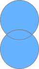
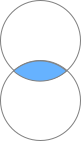

# データの結合方法(縦)

SQLでは縦方向の結合も可能ではありますが、想定していない結果になりやすく基本的にはおすすめしません。同様のことは横方向の結合でも可能な場合も多くあり、そちらのほうがいいケースも多いと思います。
利用する場合は種類と対象の条件を把握しておき、**列名ではなく列の順番**で列の対応が決まる点にもよく注意してください。col1,col2のテーブルとcol2,col3のテーブルを縦に結合しようとすると、col2がcol1,col3はcol2の後に追加されます。

## UNION
   
UNIONは、2つのテーブルやクエリの結果を縦に結合し、重複する行を除外したレコードを返します。  
片方のテーブル内で重複している場合も、重複する行は除外されます。  

```sql
SELECT sex, age
FROM sashelp.class
UNION
SELECT sex, age
FROM sashelp.class
;
```

## UNION ALL
  
UNION ALLも2つのテーブルやクエリの結果を縦に結合しますが、重複する行も含まれます。

```sql
SELECT sex, age
FROM sashelp.class
UNION ALL
SELECT sex, age
FROM sashelp.class
;
```

## INTERSECT
  
INTERSECTは、2つのテーブルやクエリの結果の共通部分を返します。つまり、両方のテーブルに存在する行のみが含まれます。

```sql
SELECT sex, age
FROM sashelp.class
INTERSECT
SELECT sex, age
FROM sashelp.class
;
```

## EXCEPT
  
EXCEPTは、1つ目のテーブルやクエリの結果から、2つ目のテーブルやクエリの結果と重複する行を除いた結果を返します。

```sql
SELECT sex, age
FROM sashelp.class
EXCEPT
SELECT sex, age
FROM sashelp.class
;
```

## OUTER UNION と CORR (SASのみ)

SASでは上記の4つに加えて、`OUTER UNION` とオプションに`CORRESPONDING` (`CORR`)があります。OUTER UNION はそのままだと2 つのテーブルの列を上書きしません。他の種類も含めCORRを指定すると両方のテーブルで同じ名前が付けられた列を上書きし、OUTER UNION以外では両方のテーブルに含まれない列の表示を抑制します。OUTER UNION ではALLは使用することはできません。データステップのsetステートメントに近いのはOUTER UNION CORRで、2つのテーブルが持つ列が同じ場合は UNION ALL CORR と OUTER UNION CORRは同じになりますが、違う場合はUNION ALL CORRのほうが列が少なくなります。

以下のコードは上記の仕様によりそれぞれ違う実行結果となります。

```sql
proc sql ;
  SELECT name, age, sex
  FROM sashelp.class
  UNION ALL 
  SELECT sex, age
  FROM sashelp.class
  ;
  SELECT name, age, sex
  FROM sashelp.class
  UNION ALL CORR
  SELECT sex, age
  FROM sashelp.class
  ;
  SELECT name, age, sex
  FROM sashelp.class
  OUTER UNION CORR
  SELECT sex, age
  FROM sashelp.class
  ;
quit ;
```